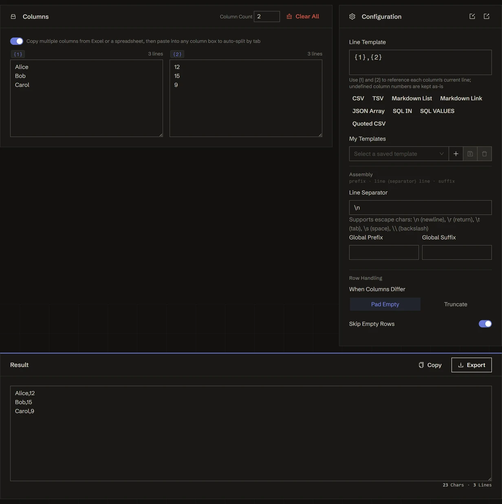

<h1 align="center">
🔗 Text Joiner
</h1>

    <em>Merge multiple text columns line by line with a template — batch-generate CSV, SQL, and JSON in your browser</em>

    <b>English</b> · <a href="./README.zh.md">简体中文</a>

  
  

**Text Joiner** aligns several columns of text by line number and stitches each row together with a template you define. Paste columns **A** and **B**, write an output line like `INSERT INTO t VALUES ({1}, '{2}')`, add an optional line separator plus a global prefix/suffix, and generate a whole block of CSV, SQL, JSON, or Markdown at once. It handles uneven columns (pad or truncate), skips empty rows on demand, and works with 1–8 columns. Everything runs entirely in your browser — no servers, no uploads.

👉 **Try it online**: <https://tools.newzone.top/en/text-joiner>

## Key Features

- **Line-by-Line Column Merge**: align multiple columns by line number and join each row with a per-line template
- **Placeholder Templates**: `{1}`, `{2}`, … reference each column freely; undefined column numbers are left as literal text
- **Uneven Columns Handled**: pad missing cells with empty strings (follow the longest column) or truncate to the shortest — with an option to skip fully-empty rows
- **Whole-Block Wrapping**: a line separator plus a global prefix/suffix build complete constructs like `IN ('a', 'b')` or JSON arrays in one shot
- **One-Click Presets**: ready-made templates for CSV, SQL `VALUES`, SQL `IN`, JSON, and Markdown
- **1–8 Columns**: scale from a single-column line formatter up to eight-way joins
- **Escape-Aware**: separators and affixes understand escape characters (e.g. `\n`, `\t`)
- **Live Preview & Export**: see the merged output instantly, copy it, or download it as a file
- **Fully Local**: runs entirely in your browser — your data stays private, nothing is uploaded

## How to Use

1. Set the **column count** (1–8) and paste each column's text into its input. Rows are aligned by line number.
2. Write the **line template** using `{n}` placeholders — e.g. `{1},{2}` for CSV or `('{1}', {2})` for SQL rows.
3. Configure the **line separator** and an optional **global prefix / suffix** to wrap the whole block.
4. Choose how to handle **uneven columns** (pad vs. truncate) and whether to **skip empty rows**.
5. Or just click a **preset** (CSV / SQL VALUES / SQL IN / JSON / Markdown) to fill everything in.
6. **Copy** or **export** the generated result.

## Common Recipes

- **CSV rows** — template `{1},{2}`, newline separator.
- **SQL `INSERT ... VALUES`** — line template `({1}, '{2}')`, separator `,\n`, global prefix `INSERT INTO t (a, b) VALUES\n` and suffix `;`.
- **SQL `IN (...)`** — line template `'{1}'`, separator `, `, prefix `IN (` and suffix `)`.
- **JSON array** — line template `"{1}"`, separator `,\n`, prefix `[\n` and suffix `\n]`.
- **Single-column formatter** — set columns to 1 and use the template to quote or affix every line.

## FAQ

**How do I merge two columns into an `A,B` format?** Paste your two texts into columns 1 and 2, click the CSV preset, and each line is joined by line number into `A,B`.

**What if the columns have different line counts?** By default, missing cells are padded with empty strings (output follows the longest column). Switch to **Truncate** to follow the shortest column and drop the extra lines.

**Can it batch-generate SQL?** Yes. The SQL `VALUES` preset fills in the line template, separator, and global prefix/suffix for a complete `INSERT` statement; the SQL `IN` preset produces `IN ('a', 'b')` fragments.

**Can I format a single column with this tool?** Yes — reduce the column count to 1 and use the template to add quotes or prefixes/suffixes to every line, turning it into a line-by-line formatter.

**Is anything uploaded?** No. The tool runs entirely in your browser — no servers, no uploads. Your data stays private.

## Documentation & Deployment

For detailed usage instructions and deployment guides, see the **[Official Documentation](https://docs.newzone.top/en/guide/text/text-joiner.html)**.

## Contributing

Contributions are welcome! Feel free to open issues and pull requests.

## About the 365 Open Source Plan

Project **#026** of the [365 Open Source Plan](https://github.com/rockbenben/365opensource) — one person + AI, 300+ open-source projects in a year. [Submit your idea →](https://365.aishort.top/) · [Discord](https://discord.gg/PZTQfJ4GjX) · [Telegram](https://t.me/aishort_top)
