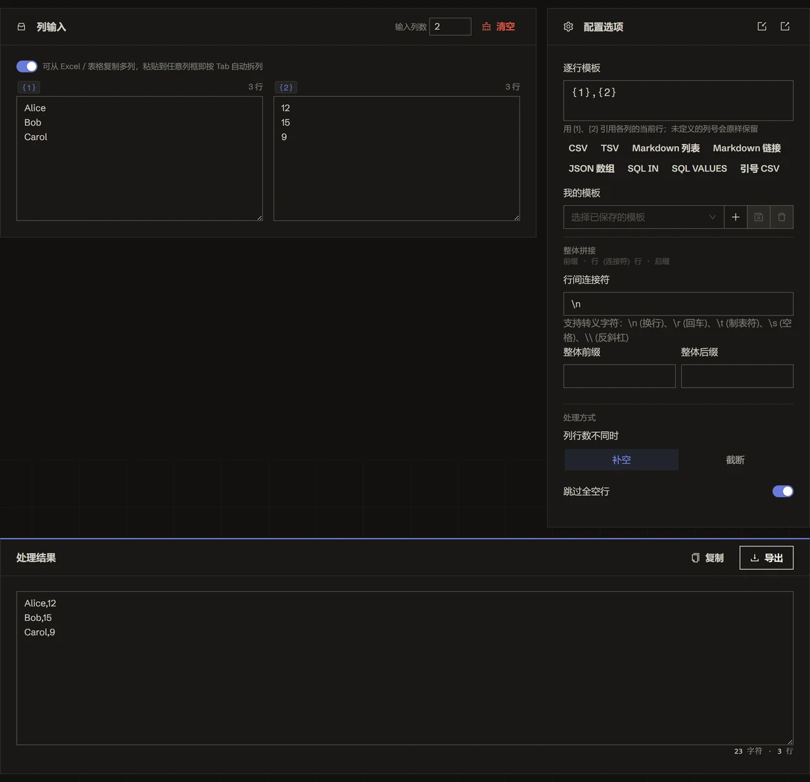

<h1 align="center">
🔗 文本拼接
</h1>

    <em>按模板将多列文本逐行拼接——在浏览器本地批量生成 CSV、SQL、JSON</em>

    <a href="./README.md">English</a> · <b>简体中文</b>

  
  

**文本拼接** 按行号对齐多列文本，用你定义的模板把每一行拼接起来。粘贴 **A**、**B** 等列，写一条输出行如 `INSERT INTO t VALUES ({1}, '{2}')`，再配上可选的行间分隔符与整体前/后缀，即可一次性生成整块 CSV、SQL、JSON 或 Markdown。它能处理列长不齐（补齐或截断）、按需跳过空行，支持 1~8 列。全程在浏览器本地运行，无服务器、无上传。

👉 **在线体验**：<https://tools.newzone.top/zh/text-joiner>

## 核心特性

- **逐行列拼接**：按行号对齐多列文本，用逐行模板把每一行拼接起来
- **占位符模板**：`{1}`、`{2}`…… 自由引用每一列；未定义的列号原样保留为字面文本
- **列长不齐处理**：缺失单元格补空串（按最长列输出），或截断到最短列——并可跳过全空行
- **整块包裹**：行间分隔符 + 整体前/后缀，一次拼出 `IN ('a', 'b')`、JSON 数组等完整结构
- **一键预设**：CSV、SQL `VALUES`、SQL `IN`、JSON、Markdown 现成模板
- **1~8 列**：从单列逐行格式化，到八路拼接自由伸缩
- **转义感知**：分隔符与前后缀识别转义字符（如 `\n`、`\t`）
- **实时预览与导出**：即时查看拼接结果，可复制或导出为文件
- **完全本地**：全程在浏览器运行——数据保持私密，无上传

## 使用方法

1. 设置 **列数**（1~8），把每列文本粘进对应输入框，各行按行号对齐。
2. 用 `{n}` 占位符写 **行模板**——如 CSV 用 `{1},{2}`，SQL 行用 `('{1}', {2})`。
3. 配置 **行间分隔符** 与可选的 **整体前缀 / 后缀**，包裹整块输出。
4. 选择 **列长不齐** 的处理方式（补齐 / 截断），以及是否 **跳过空行**。
5. 或直接点 **预设**（CSV / SQL VALUES / SQL IN / JSON / Markdown）一键填好全部配置。
6. **复制** 或 **导出** 生成的结果。

## 常见配方

- **CSV 行** —— 模板 `{1},{2}`，换行分隔。
- **SQL `INSERT ... VALUES`** —— 行模板 `({1}, '{2}')`，分隔符 `,\n`，整体前缀 `INSERT INTO t (a, b) VALUES\n`、后缀 `;`。
- **SQL `IN (...)`** —— 行模板 `'{1}'`，分隔符 `, `，前缀 `IN (`、后缀 `)`。
- **JSON 数组** —— 行模板 `"{1}"`，分隔符 `,\n`，前缀 `[\n`、后缀 `\n]`。
- **单列格式化** —— 列数设为 1，用模板给每一行加引号或前后缀。

## 常见问题

**怎么把两列文本合成 `A,B` 格式？** 把两段文本分别粘进第 1、2 列，点 CSV 预设，每行会按行号对齐拼成 `A,B`。

**两列行数不一样怎么办？** 默认「补空」，缺失的单元格用空字符串补齐（按最长列输出）；也可切换为「截断」，按最短列对齐并丢弃多余行。

**能批量生成 SQL 吗？** 能。SQL `VALUES` 预设会自动填好模板、行间分隔符与整体前/后缀，粘上数据即可拼出完整 `INSERT` 语句；SQL `IN` 预设则生成 `IN ('a', 'b')` 片段。

**能用它格式化单列文本吗？** 能——把列数降为 1，用模板给每一行加引号或前后缀，即变成逐行格式化工具。

**会上传内容吗？** 不会。工具完全在浏览器本地运行，无服务器、无上传，数据保持私密。

## 文档与部署

详细使用说明与部署指南见 **[官方文档](https://docs.newzone.top/guide/text/text-joiner.html)**。

## 贡献

欢迎贡献！随时提交 issue 与 pull request。

## 关于 365 开源计划

[365 开源计划](https://github.com/rockbenben/365opensource) 的第 **#026** 个项目——一个人 + AI，一年 300+ 个开源项目。[提交你的需求 →](https://365.aishort.top/) · [Discord](https://discord.gg/PZTQfJ4GjX) · [Telegram](https://t.me/aishort_top)
